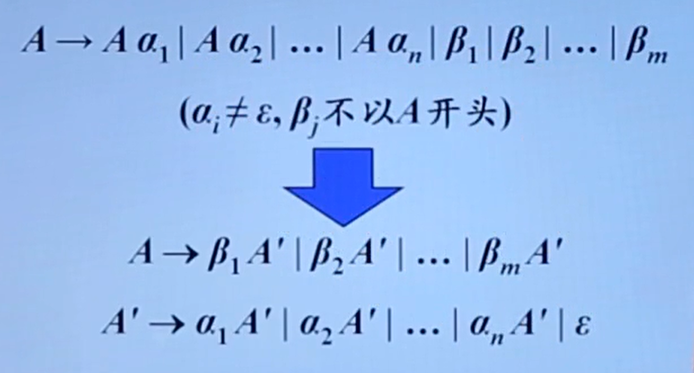
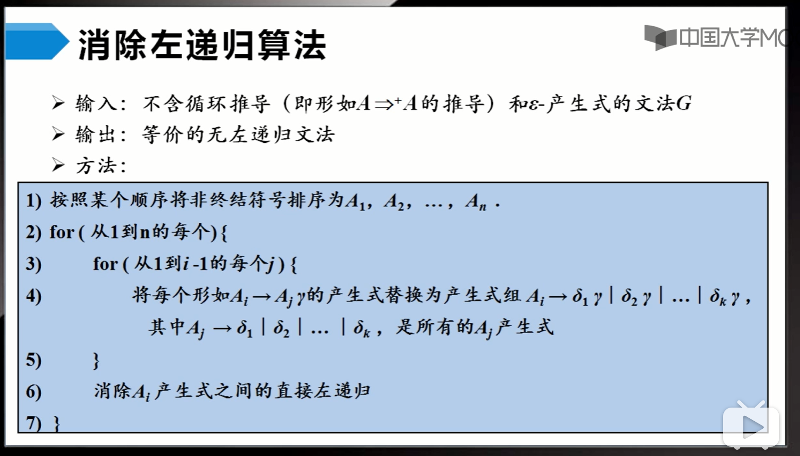
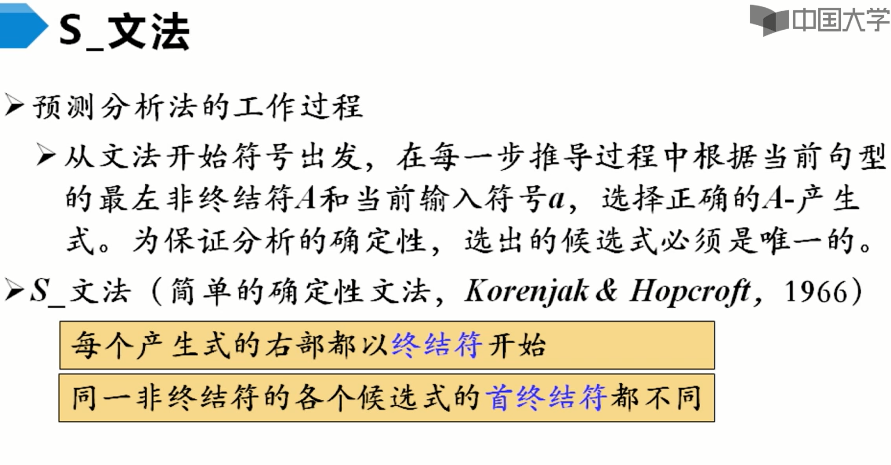
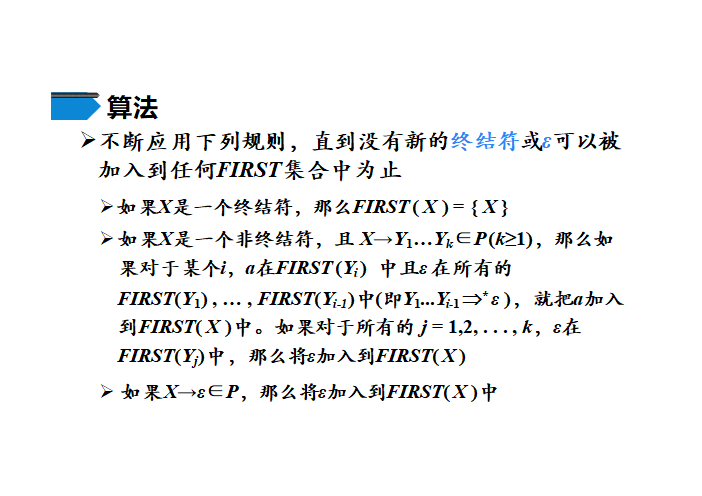
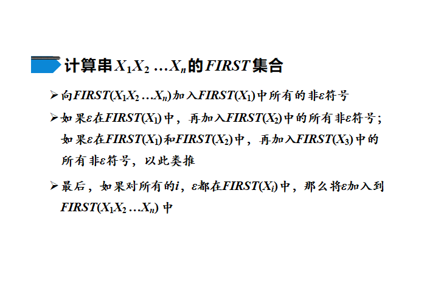
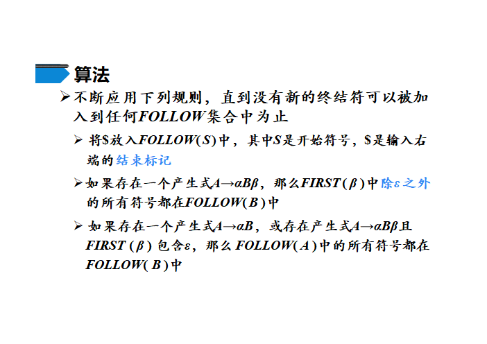
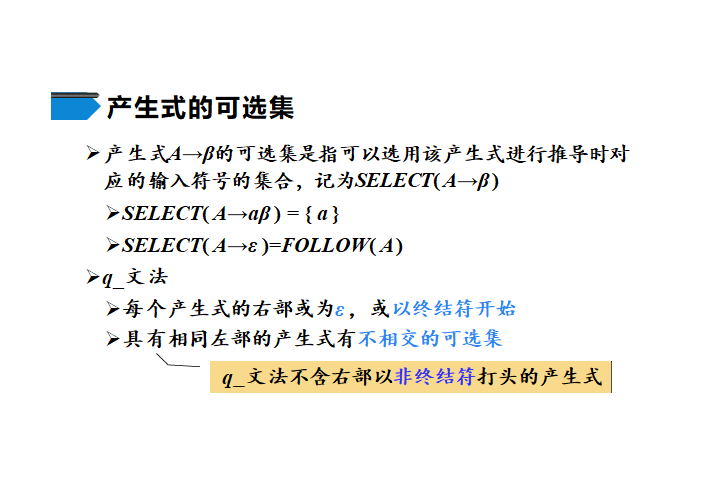
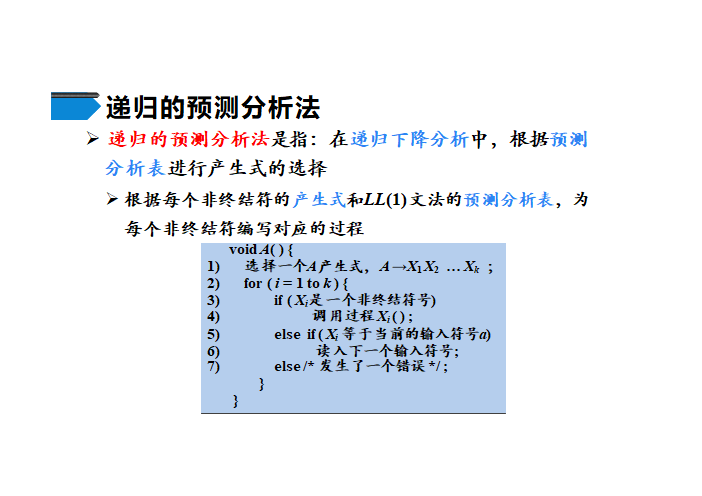
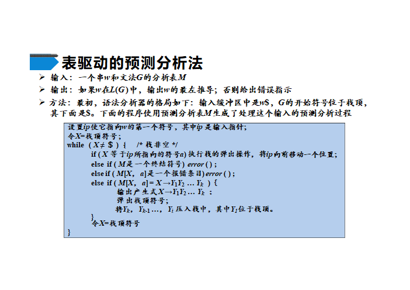
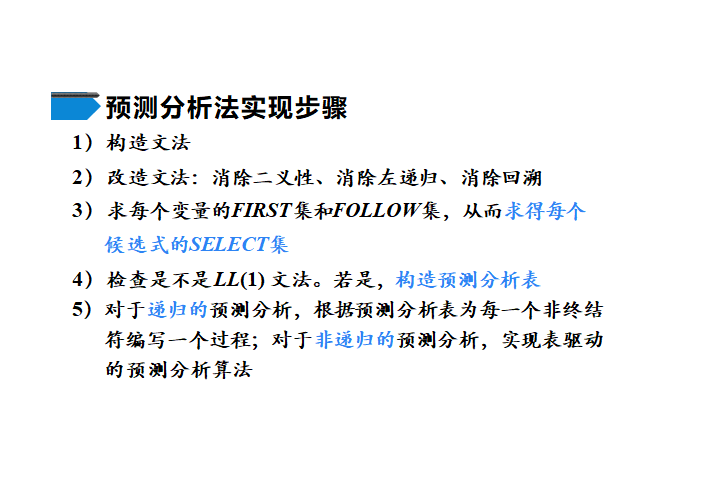

# 0型文法
又作：非限制文法

## 定义
$\forall \alpha\rightarrow\beta$，其中$\alpha$中至少有一个非终结符

# 1型文法
又作：上下文有关文法

## 定义
$\forall \alpha\rightarrow\beta,|\alpha|\le|\beta|$

一般来说是$\alpha_1A\alpha_2\rightarrow\alpha_1\beta\alpha_2(\beta\ne\varepsilon)$

# 2型文法

又作：上下文无关文法

左部必须是一个非终结符，即：$A\rightarrow\beta$

# 3型文法

又作：正则文法

在上下文无关文法的基础上
- 左线性文法：$A\rightarrow Bw$或$A\rightarrow w$，其中$w$是终结符*串*
- 右线性文法：$A\rightarrow wB$或$A\rightarrow w$

右部只有一个非终结符

# 二义性文法
即，歧义

## 怎么办？
1. 改进文法
2. 引入消岐规则：规定离else最近的一个尚未匹配的if进行匹配

# 自顶向下的分析
## 最左推导

自顶向下的分析采用最左推导

## 递归下降分析
由一组过程（函数）组成，每个过程对应一个“非终结符”

# 文法转换
## 1. 回溯
## 2. 左递归
1. 输入：无循环产生式 且 无$\varepsilon-$产生式TODOWHY?

# LL0
预测

## 条件

要求（局限）：不包括空产生式

## $\operatorname{FOLLOW}$集和可选集

## q_文法

# LL1
TODO

## $\operatorname{FIRST}$集
$\operatorname{FIRST}$(X)：可以通过X推导出的所有**串首终结符**或$\varepsilon$构成的集合

## $\operatorname{FOLLOW}$集
$\operatorname{FOLLOW}$(X)：在所有可能出现的句型中，紧跟在X后的终结符a或$的集合

> ATTENTION $\varepsilon$不是终结符，但是要加到$\operatorname{FIRST}$集中；$不是终结符，但是要加到$\operatorname{FOLLOW}$集中

$\operatorname{FOLLOW}$集可能要运行多次

## $\operatorname{SELECT}$集

- $\operatorname{SELECT}$(A->a$\beta$)={a}
- $\operatorname{SELECT}$(A->B$\beta'$)=$\operatorname{FIRST}$(B)
- $\operatorname{SELECT}$(A->$\varepsilon$)=$\operatorname{FOLLOW}$(A)

> LL1文法要求：同一非终结符的各个产生式的可选集**互不相交**

> 由可选集的*定义*，可根据SELECT集构造预测分析表

## 递归预测分析法

## 非递归的预测分析法

---
