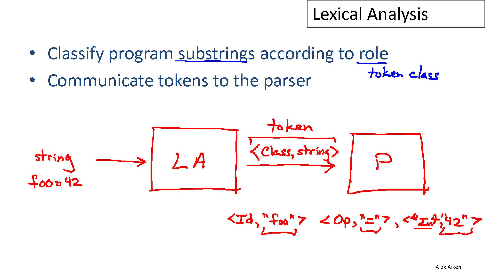
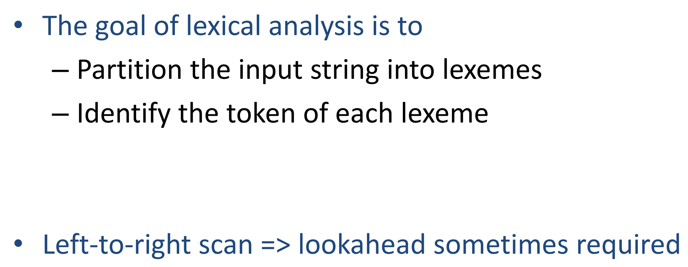
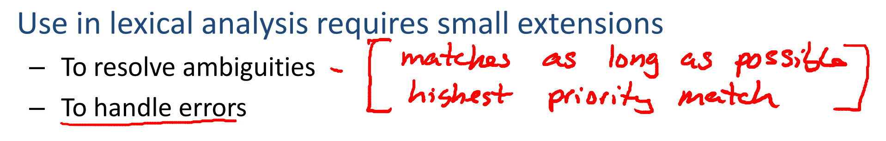

<<<<<<< HEAD
# Structure of a Compiler
## Lexical Analysis
divided program text into **tokens**.
## Parsing
get a parsing tree of the code's structure.
## Sematic Analysis
The meaning of the codes.

## Optimization

## Code Gen
produce assembly code.

# Lexical Analysis

## (Token) class
### identifier
`x`
### Integer

### Keyword
`if`-`else`...
### Whitespace

### Operator

**Goal**:
<u>Patition the string</u>

lookahead
---
to decide where one token ends and the next token begins.

ex:`>>` : `Foo<Bar<T>>` <-> `cin >>`

# Lexical Specification
1. Maximal Match
2. highest priority match

## Finite AutoMaton
Language of a `FA`:
set of accepted strings;

---
### FA(Finite Automaton)

1. DFA

    用五元组$S,s_0,F,\Sigma,\delta$来表述：
    - $S$是所有 **状态(state)** 的集合
    - $s_0\in{S}$是起始状态
    - $F\subset{S}$是 **可接受状态(accepting state)** 的集合
    - $\Sigma$是**字符集(alphabet)**,$\color{orange}{\underline{\varepsilon\notin \Sigma}}$
    - $\delta$是**转移函数(transition func)**：$\delta : S\times \Sigma \rightarrow{\it\bold\color{red}{\underline{S}}}$
2. NFA
   
   用五元组$S,s_0,F,\Sigma,\delta$来表述：
    - $S$是所有 **状态(state)** 的集合
    - $s_0\in{S}$是起始状态
    - $F\subset{S}$是 **可接受状态(accepting state)** 的集合
    - $\Sigma$是**字符集(alphabet)**
    - $\delta$是**转移函数(transition func)**：$\delta : S\times \Sigma \rightarrow{\it\bold\color{red}{\underline{2^S}}}$

区别：
1. NFA从某个状态s出发经过**同一个输入a**可到达多个不同的状态，所以是不能确定的，而DFA从状态s出发，经过同一个输入a只能到达同一个确定的状态。如上文红色所示。
2. NFA的字符集中可以包括空串$\varepsilon$，而DFA中不是，如橙色所示。

$\star$其他符号：
- $\Sigma^*$：Keleene闭包，表示所有由字符集$\Sigma$可以生成的有限长字符串的集合

$\star$最长匹配原则：如果从一个接收状态$F_1$能通过数次匹配的转移函数到达另一个接收状态$F_2$，那么最终的匹配应该是到达$F_2$的匹配.

---
### NFA & DFA及其转化

识别无符号数的DFA

  1. 文法$G$
     1. $digit\rightarrow{}0|1|...|9$
     2. $digits\rightarrow{}digit\ digit*$
     3. $optinalFraction\rightarrow{}.dights|\varepsilon$
     4. $optionalExponent\rightarrow{}(E(+|-|\varepsilon)digits)|\varepsilon$
     5. $num\rightarrow{}digits\ optionalFraction \ optionalExponent$
   
  2. NFA
    
  3. DFA

---
# 自顶向下分析法
1. 输入中当前被扫描的终结符号通常称为*向前看*(lookahead)符号

$L(A)$表示自动机$A$*接受*(accept)的语言。

# ZH-ENG Comparision
| ENG       | ZH         |
| --------- | ---------- |
| syntax    | 语法       |
| lexical   | 词法       |
| lexeme    |            |
| sematic   | 语义       |
| token     |            |
| grammer   | 文法       |
| lookahead | 向前看符号 |
=======
# Structure of a Compiler
## Lexical Analysis
divided program text into **tokens**.
## Parsing
get a parsing tree of the code's structure.
## Sematic Analysis
The meaning of the codes.

## Optimization

## Code Gen
produce assembly code.

# Lexical Analysis

## (Token) class
### identifier
`x`
### Integer

### Keyword
`if`-`else`...
### Whitespace

### Operator

**Goal**:
<u>Patition the string</u>

lookahead
---
to decide where one token ends and the next token begins.

ex:`>>` : `Foo<Bar<T>>` <-> `cin >>`

# Lexical Specification
1. Maximal Match
2. highest priority match

## Finite AutoMaton
Language of a `FA`:
set of accepted strings;

---
### FA(Finite Automaton)

1. DFA

    用五元组$S,s_0,F,\Sigma,\delta$来表述：
    - $S$是所有 **状态(state)** 的集合
    - $s_0\in{S}$是起始状态
    - $F\subset{S}$是 **可接受状态(accepting state)** 的集合
    - $\Sigma$是**字符集(alphabet)**,$\color{orange}{\underline{\varepsilon\notin \Sigma}}$
    - $\delta$是**转移函数(transition func)**：$\delta : S\times \Sigma \rightarrow{\it\bold\color{red}{\underline{S}}}$
2. NFA
   
   用五元组$S,s_0,F,\Sigma,\delta$来表述：
    - $S$是所有 **状态(state)** 的集合
    - $s_0\in{S}$是起始状态
    - $F\subset{S}$是 **可接受状态(accepting state)** 的集合
    - $\Sigma$是**字符集(alphabet)**
    - $\delta$是**转移函数(transition func)**：$\delta : S\times \Sigma \rightarrow{\it\bold\color{red}{\underline{2^S}}}$

区别：
1. NFA从某个状态s出发经过**同一个输入a**可到达多个不同的状态，所以是不能确定的，而DFA从状态s出发，经过同一个输入a只能到达同一个确定的状态。如上文红色所示。
2. NFA的字符集中可以包括空串$\varepsilon$，而DFA中不是，如橙色所示。

$\star$其他符号：
- $\Sigma^*$：Keleene闭包，表示所有由字符集$\Sigma$可以生成的有限长字符串的集合

$\star$最长匹配原则：如果从一个接收状态$F_1$能通过数次匹配的转移函数到达另一个接收状态$F_2$，那么最终的匹配应该是到达$F_2$的匹配.

---
### NFA & DFA及其转化

识别无符号数的DFA

  1. 文法$G$
     1. $digit\rightarrow{}0|1|...|9$
     2. $digits\rightarrow{}digit\ digit*$
     3. $optinalFraction\rightarrow{}.dights|\varepsilon$
     4. $optionalExponent\rightarrow{}(E(+|-|\varepsilon)digits)|\varepsilon$
     5. $num\rightarrow{}digits\ optionalFraction \ optionalExponent$
   
  2. NFA
    
  3. DFA

---
# 自顶向下分析法
1. 输入中当前被扫描的终结符号通常称为*向前看*(lookahead)符号

$L(A)$表示自动机$A$*接受*(accept)的语言。

# ZH-ENG Comparision
| ENG       | ZH         |
| --------- | ---------- |
| syntax    | 语法       |
| lexical   | 词法       |
| lexeme    |            |
| sematic   | 语义       |
| token     |            |
| grammer   | 文法       |
| lookahead | 向前看符号 |

<i class="fab fa-weixin"></i>

<head> 
     
     
</head> 
<link rel="stylesheet" href="https://use.fontawesome.com/releases/v5.1.0/css/all.css">
>>>>>>> 96f597fcf29060d02e02ba9b0c0153e2680e720d
